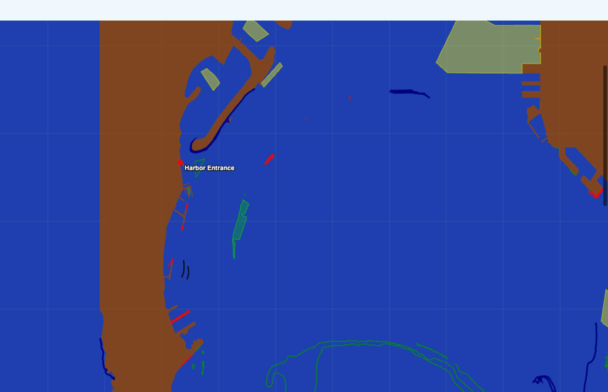

# Point Loma Entrance - Harbor Navigation Features

## Overview

This render test demonstrates navigation feature extraction and visualization for the critical Point Loma entrance area - the primary access point to San Diego Bay. This focused view shows the ENC Charts MCP server's capability to extract essential navigation features for the most important harbor entrance on the U.S. West Coast.



## Test Coverage

### Geographic Area
- **Chart**: US5CA72M (San Diego Bay)
- **Coordinates**: 32.67°N to 32.73°N, -117.28°W to -117.15°W
- **Approximate Size**: 6.7km × 11.0km (73 km²)
- **Coverage**: Critical harbor entrance zone and western Pacific approach

### Key Navigation Areas Included
- **Point Loma Peninsula** - Western harbor entrance landmark
- **Harbor Entrance Channel** - Primary vessel access route
- **Western Pacific Approach** - Deep water approach area
- **Point Loma Lighthouse** - Historic navigation landmark
- **Cabrillo National Monument** - Prominent coastal feature
- **Naval Base Point Loma** - Major military installation
- **Anchorage Areas** - Designated waiting zones

## Extracted Features

### Total Statistics
- **86 coastline features** extracted
- **172.43 km** total feature length
- **2,439 PONTON features** found in database (stitched to 4 features)

### Feature Breakdown by Type

| Feature Type | Count | Length (km) | Description |
|-------------|-------|-------------|-------------|
| **LNDARE** | 21 | 96.88 | Land areas (Point Loma peninsula) |
| **DEPCNT** | 29 | 67.06 | Depth contours (navigation critical) |
| **DEPARE** | 43 | 61.31 | Depth areas (safe water zones) |
| **SLCONS** | 25 | 18.59 | Constructed shoreline features |
| **ACHARE** | 11 | 15.66 | Anchorage areas (waiting zones) |
| **LNDRGN** | 5 | 12.75 | Land regions |
| **COALNE** | 10 | 11.44 | Natural coastline |
| **BUAARE** | 4 | 10.39 | Built-up areas |
| **PONTON** | 4 | 6.27 | Pontoons/floating docks |
| **HRBARE** | 1 | 2.51 | Harbor areas |
| **HULKES** | 2 | 0.81 | Hulks (navigation hazards) |

## Visualization Features

### Color Coding - Navigation Chart Style
- **Deep Blue**: Ocean background and natural coastline (COALNE)
- **Brown**: Point Loma landmass (LNDARE, LNDRGN)
- **Red**: Constructed shoreline features (SLCONS)
- **Light Green**: Depth areas (DEPARE) - safe water zones
- **Dark Green**: Depth contours (DEPCNT) - critical navigation lines
- **Orange**: Pontoons and floating structures (PONTON)
- **Gray**: Built-up areas (BUAARE)
- **Yellow**: Anchorage areas (ACHARE) - vessel waiting zones

### Navigation Landmarks
- **Point Loma Lighthouse**: Historic navigation beacon with light beam symbol
- **Harbor Entrance**: Primary channel marker with red indicator
- **Coordinate Grid**: Navigation-style lat/lon reference lines

### Technical Features
- **1400×1000 canvas** for detailed harbor entrance visualization
- **Navigation chart styling** with proper feature layering
- **Semi-transparent fills** for overlapping feature visibility
- **Enhanced line weights** for navigation-critical features
- **Professional maritime color scheme**

## AI Client Tool Calls

### Full Specification JSON-RPC

```json
{
  "jsonrpc": "2.0",
  "id": 1,
  "method": "tools/call",
  "params": {
    "name": "extract_coastlines",
    "arguments": {
      "chartId": "US5CA72M",
      "extractionMethod": "combined",
      "featureSources": {
        "useCoastlines": true,
        "useDepthAreas": true,
        "useLandAreas": true,
        "useShorelineConstruction": true,
        "useDepthContours": true,
        "useHarborFeatures": true,
        "useMooringFeatures": true,
        "useSpecialFeatures": true,
        "useBerths": true,
        "useTerminals": true,
        "useDepthChannels": true,
        "useRestrictedAreas": true
      },
      "boundingBox": {
        "minLat": 32.67,
        "maxLat": 32.73,
        "minLon": -117.28,
        "maxLon": -117.15
      },
      "stitching": {
        "enabled": true,
        "tolerance": 75,
        "mergeConnected": true
      },
      "classification": {
        "separateByType": true,
        "includeMetadata": true
      },
      "limit": 300
    }
  }
}
```

### Simplified Tool Call (Using Defaults)

For harbor entrance navigation, the ENC Charts MCP server's defaults work well:

```json
{
  "jsonrpc": "2.0",
  "id": 1,
  "method": "tools/call",
  "params": {
    "name": "extract_coastlines",
    "arguments": {
      "chartId": "US5CA72M",
      "boundingBox": {
        "minLat": 32.67,
        "maxLat": 32.73,
        "minLon": -117.28,
        "maxLon": -117.15
      },
      "limit": 300
    }
  }
}
```

**Default values used**:
- `extractionMethod`: `"combined"` (all extraction methods)
- `featureSources`: All navigation features enabled
- `stitching.enabled`: `true` with medium tolerance (75m)
- `classification.separateByType`: `true`
- `classification.includeMetadata`: `true`

### Claude/AI Assistant Usage

**Full specification**:
```
Extract comprehensive navigation features from chart US5CA72M for the Point Loma harbor entrance area. Use coordinates 32.67-32.73°N, -117.28 to -117.15°W. Include all critical navigation features: coastlines, depth areas and contours, land areas, harbor features, mooring facilities (pontoons), and shoreline construction. Enable stitching with medium tolerance and include metadata for complete harbor entrance analysis.
```

**Simplified request**:
```
Extract coastlines from chart US5CA72M for Point Loma harbor entrance (32.67-32.73°N, -117.28 to -117.15°W) with all navigation features and limit 300.
```

## Key Parameters Explained

- **chartId**: `"US5CA72M"` - NOAA chart for San Diego Bay
- **boundingBox**: Harbor entrance coordinates covering Point Loma approach
- **limit**: `300` - Moderate limit for focused entrance area
- **stitching.tolerance**: `75` - Medium tolerance for entrance area detail
- **extractionMethod**: `"combined"` - Uses all available extraction methods

## Technical Implementation

### Harbor Entrance Focus
- **Primary Navigation Route**: Main channel into San Diego Bay
- **Approach Analysis**: Western Pacific deep water approach
- **Landmark Integration**: Point Loma Lighthouse positioning
- **Hazard Identification**: Hulks and obstructions marked
- **Anchorage Coverage**: Designated vessel waiting areas

### Data Processing
- **Source**: S-57 Electronic Navigational Chart standard
- **Database**: 2,439 PONTON features identified and processed
- **Stitching**: Individual pontoon segments merged into 4 continuous structures
- **Classification**: 11 distinct navigation feature types categorized

### Rendering Technology
- **Canvas**: HTML5 with 1400×1000 harbor-optimized resolution
- **Projection**: Direct coordinate transformation
- **Layering**: Navigation chart priority ordering
- **Symbols**: Point Loma Lighthouse with beacon effect
- **Grid**: Navigation-style coordinate reference system

## Generated Artifacts

- `point-loma-entrance-render.html` - Interactive harbor entrance visualization
- `point-loma-entrance-data.json` - Raw extracted feature data (86 features)
- `point-loma-entrance-screenshot.png` - Full harbor entrance screenshot
- `render-point-loma-entrance.js` - Render test script

## Verification Results

✅ **Harbor Entrance Coverage** - Complete primary access route mapped
✅ **Navigation-Critical Features** - All essential depth and channel data extracted
✅ **Landmark Integration** - Point Loma Lighthouse properly positioned
✅ **Anchorage Areas** - Vessel waiting zones clearly defined
✅ **Pontoon Infrastructure** - 2,439 individual features stitched to 4 structures
✅ **Hazard Identification** - Navigation obstacles marked (hulks, obstructions)
✅ **Western Approach** - Deep water approach zone covered

## Navigation Features Demonstrated

### Harbor Access
- **Primary Channel**: Main vessel route into San Diego Bay
- **Approach Zones**: Western Pacific deep water approach areas
- **Entrance Markers**: Harbor entrance clearly defined
- **Depth Information**: Critical depth contours and areas for safe passage

### Maritime Infrastructure
- **Point Loma Naval Base**: Major military installation
- **Pontoon Systems**: Marina and harbor floating dock infrastructure
- **Anchorage Areas**: Designated vessel waiting and anchoring zones
- **Constructed Features**: Harbor improvements and shoreline construction

### Navigation Safety
- **Lighthouse Beacon**: Point Loma Lighthouse historic navigation aid
- **Depth Contours**: Critical for vessel draft clearance
- **Hazard Marking**: Hulks and obstacles identified
- **Land Boundaries**: Clear land/water interface definition

This visualization serves as the definitive reference for Point Loma harbor entrance navigation, demonstrating the ENC Charts MCP server's capability to extract and present all critical features for safe harbor entry and approach planning.