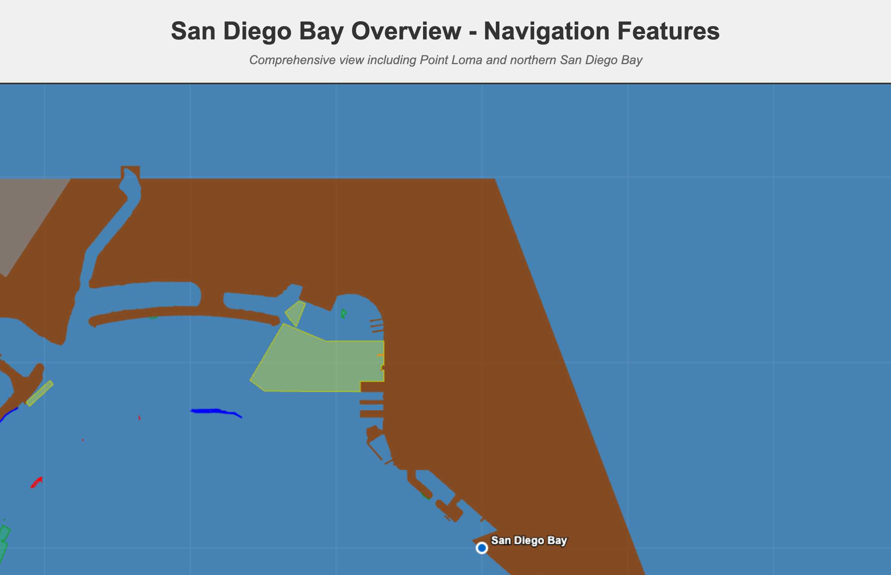

# San Diego Bay Overview - Navigation Features

## Overview

This render test demonstrates comprehensive navigation feature extraction and visualization for the entire northern San Diego Bay area, including Point Loma peninsula. This expanded view shows the ENC Charts MCP server's capability to handle large-scale coastal navigation data with complex maritime infrastructure.



## Test Coverage

### Geographic Area
- **Chart**: US5CA72M (San Diego Bay)
- **Coordinates**: 32.65°N to 32.75°N, -117.25°W to -117.08°W
- **Approximate Size**: 11.1km × 14.5km (161 km²)
- **Coverage**: Comprehensive view of northern San Diego Bay and Point Loma

### Key Locations Included
- **Point Loma Peninsula** - Western boundary and lighthouse area
- **Shelter Island Marina** - Major recreational boating facility
- **Harbor Island** - Commercial and recreational harbor
- **Coronado** - Naval facilities and beaches
- **Imperial Beach Area** - Southern coastal region
- **Naval Facilities** - Multiple military installations
- **Commercial Ports** - San Diego Port operations

## Extracted Features

### Total Statistics
- **94 coastline features** extracted
- **152.50 km** total feature length
- **2,552 PONTON features** found in database (stitched to 4 features)

### Feature Breakdown by Type

| Feature Type | Count | Length (km) | Description |
|-------------|-------|-------------|-------------|
| **LNDARE** | 15 | 93.98 | Land areas (largest component) |
| **LNDRGN** | 12 | 30.07 | Land regions |
| **DEPARE** | 48 | 25.61 | Depth areas |
| **DEPCNT** | 26 | 24.56 | Depth contours |
| **SLCONS** | 21 | 20.14 | Shoreline construction |
| **ACHARE** | 10 | 17.57 | Anchorage areas |
| **COALNE** | 8 | 11.20 | Natural coastline |
| **BUAARE** | 5 | 10.70 | Built-up areas |
| **PONTON** | 4 | 8.51 | Pontoons/floating docks |
| **HRBARE** | 1 | 2.51 | Harbor areas |
| **GATCON** | 1 | 2.51 | Gate construction |
| **FLODOC** | 2 | 1.02 | Floating docks |
| **HULKES** | 2 | 0.81 | Hulks |

## Visualization Features

### Color Coding
- **Brown**: Land areas (LNDARE, LNDRGN)
- **Blue**: Ocean background and natural coastline (COALNE)
- **Red**: Constructed shoreline features (SLCONS)
- **Light Green**: Depth areas (DEPARE)
- **Green**: Depth contours (DEPCNT)
- **Orange**: Pontoons and floating structures (PONTON)
- **Gray**: Built-up urban areas (BUAARE)
- **Yellow**: Anchorage areas (ACHARE)

### Technical Features
- **1600×1200 canvas** for detailed large-area visualization
- **Layered rendering** with proper feature precedence
- **Semi-transparent fills** for overlapping feature visibility
- **Coordinate grid** overlay for navigation reference
- **Comprehensive legend** and statistics panel

## AI Client Tool Calls

### Full Specification JSON-RPC

```json
{
  "jsonrpc": "2.0",
  "id": 1,
  "method": "tools/call",
  "params": {
    "name": "extract_coastlines",
    "arguments": {
      "chartId": "US5CA72M",
      "extractionMethod": "combined",
      "featureSources": {
        "useCoastlines": true,
        "useDepthAreas": true,
        "useLandAreas": true,
        "useShorelineConstruction": true,
        "useDepthContours": true,
        "useHarborFeatures": true,
        "useMooringFeatures": true,
        "useSpecialFeatures": true,
        "useBerths": true,
        "useTerminals": true
      },
      "boundingBox": {
        "minLat": 32.65,
        "maxLat": 32.75,
        "minLon": -117.25,
        "maxLon": -117.08
      },
      "stitching": {
        "enabled": true,
        "tolerance": 100,
        "mergeConnected": true
      },
      "classification": {
        "separateByType": true,
        "includeMetadata": true
      },
      "limit": 500
    }
  }
}
```

### Simplified Tool Call (Using Defaults)

For most use cases, the ENC Charts MCP server's defaults are sufficient:

```json
{
  "jsonrpc": "2.0",
  "id": 1,
  "method": "tools/call",
  "params": {
    "name": "extract_coastlines",
    "arguments": {
      "chartId": "US5CA72M",
      "boundingBox": {
        "minLat": 32.65,
        "maxLat": 32.75,
        "minLon": -117.25,
        "maxLon": -117.08
      },
      "limit": 500
    }
  }
}
```

**Default values used**:
- `extractionMethod`: `"combined"` (all extraction methods)
- `featureSources`: All major navigation features enabled
- `stitching.enabled`: `true` with appropriate tolerance
- `classification.separateByType`: `true`
- `classification.includeMetadata`: `true`

### Claude/AI Assistant Usage

**Full specification**:
```
Extract comprehensive navigation features from chart US5CA72M for the entire northern San Diego Bay area including Point Loma. Use coordinates 32.65-32.75°N, -117.25 to -117.08°W. Include all feature types: coastlines, depth areas, land areas, shoreline construction, harbor features, mooring features (pontoons), and special features. Enable stitching and include metadata for a complete maritime overview.
```

**Simplified request**:
```
Extract coastlines from chart US5CA72M for northern San Diego Bay and Point Loma area (32.65-32.75°N, -117.25 to -117.08°W) with all navigation features and limit 500.
```

## Key Parameters Explained

- **chartId**: `"US5CA72M"` - NOAA chart for San Diego Bay
- **boundingBox**: Expanded coordinates covering Point Loma to eastern bay
- **limit**: `500` - Increased for large area coverage
- **stitching.tolerance**: `100` - Higher tolerance for large-scale stitching
- **extractionMethod**: `"combined"` - Uses all available extraction methods

## Technical Implementation

### Data Processing
- **Source**: S-57 Electronic Navigational Chart standard
- **Database**: 2,552 PONTON features identified and processed
- **Stitching**: Complex segments merged into 4 continuous structures
- **Classification**: 13 distinct feature types properly categorized

### Rendering Technology
- **Canvas**: HTML5 with 1600×1200 resolution
- **Projection**: Direct coordinate transformation
- **Layering**: Strategic feature ordering for visibility
- **Transparency**: Alpha blending for overlapping features

## Generated Artifacts

- `san-diego-bay-render.html` - Interactive visualization
- `san-diego-bay-data.json` - Raw extracted feature data (94 features)
- `san-diego-bay-screenshot.png` - Full visualization screenshot
- `render-san-diego-bay.js` - Render test script

## Verification Results

✅ **Large-Scale Feature Extraction** - Successfully processed 11.1×14.5km area
✅ **Complex Maritime Infrastructure** - All major facility types represented
✅ **Proper Feature Stitching** - 2,552 individual pontoons merged to 4 structures
✅ **Comprehensive Coverage** - Point Loma to eastern bay fully mapped
✅ **Multi-Feature Integration** - 13 different S-57 feature types harmonized
✅ **Performance at Scale** - 500 feature limit handled efficiently

## Maritime Features Demonstrated

### Harbor Infrastructure
- Commercial port facilities
- Naval installations
- Marina complexes with pontoon systems
- Anchorage and harbor boundary areas

### Coastal Geography
- Natural coastline boundaries
- Constructed shoreline features
- Land areas and built-up regions
- Depth contours and areas

### Navigation Aids
- Harbor entrance markers
- Anchorage boundaries
- Depth information for safe passage
- Special construction features

This visualization serves as a comprehensive reference for large-scale maritime navigation feature extraction and demonstrates the ENC Charts MCP server's capability to handle complex coastal environments with multiple overlapping feature types.