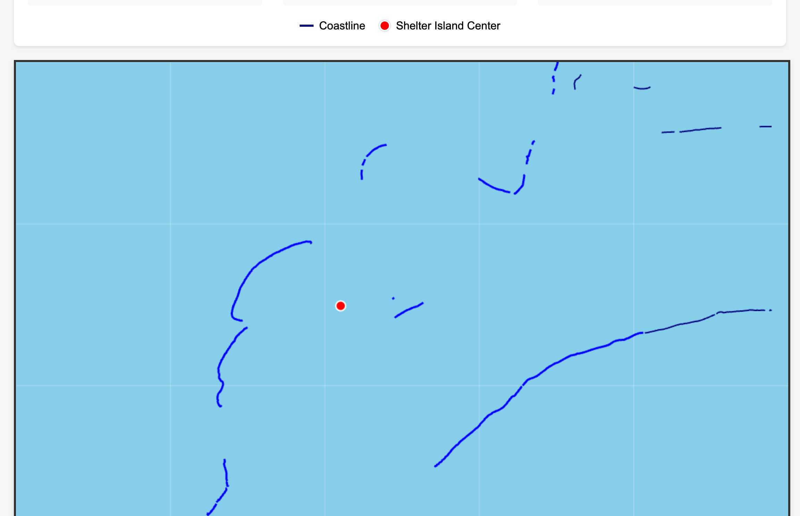

# San Diego Bay Coastline Extraction Test - FAILURE REPORT

## Test Summary
**Date:** 2025-06-30  
**Status:** ❌ **FAILED**  
**Location:** Shelter Island, San Diego Bay  
**Coordinates:** 32.714935, -117.228975  

## Test Objective
Extract and render cohesive coastline boundaries for Shelter Island peninsula from NOAA ENC chart data.

## Expected Result
A continuous, connected coastline boundary showing Shelter Island as a peninsula extending into San Diego Bay, matching the satellite imagery reference.

## Actual Result
The coastline extraction produced **disconnected segments** that do not form a cohesive boundary:
- 31 total coastline features extracted
- 23 features near Shelter Island
- Features are fragmented and disconnected
- No continuous peninsula shape is formed

## Failure Analysis

### Primary Issue: Lack of Coastline Cohesion
The extracted COALNE features from the S-57 chart data are not properly connected:

1. **Disconnected Segments**: The coastline is broken into multiple unconnected line segments
2. **No Continuous Boundary**: The segments do not form a continuous water/land boundary
3. **Missing Peninsula Shape**: The characteristic curved peninsula shape of Shelter Island is not recognizable due to fragmentation

### Visual Evidence

The render clearly shows:
- Multiple disconnected blue line segments
- Gaps between coastline features
- No clear peninsula outline around the red Shelter Island marker

## Technical Details

### Data Extracted
- **Source File**: `docs/tests/san-diego-coastline-test/raw-coastlines.json`
- **Feature Type**: COALNE (Coastline)
- **Total Features**: 31
- **Near Target**: 23
- **Total Points**: 632 coordinate points

### Root Cause
The S-57 COALNE (coastline) features in the NOAA ENC chart are stored as individual, disconnected line segments rather than as continuous boundaries. This is the nature of how the data is encoded in the chart.

## Recommendations

1. **Implement Robust Stitching**: Develop or improve coastline stitching algorithm to connect nearby segments
2. **Expand Feature Sources**: Include additional S-57 object classes that may contain coastline data:
   - SLCONS (Shoreline Construction)
   - LNDARE (Land Area) boundaries
   - DEPARE (Depth Area) boundaries at 0m depth
3. **Gap Detection and Filling**: Implement logic to detect and interpolate small gaps between segments
4. **Topology Validation**: Add validation to ensure extracted coastlines form closed or continuous boundaries

## Test Artifacts
- `render-coastlines.html` - Interactive visualization showing disconnected segments
- `coastline-data.js` - Embedded coastline data for the HTML renderer
- `coastline-render-screenshot.png` - Screenshot showing the failure
- `reference-satellite-image.jpg` - Satellite image reference for comparison

## Conclusion
The test fails because the extracted coastline does not provide a usable, continuous boundary for Shelter Island. The disconnected segments would not be suitable for navigation purposes or geographic analysis without significant post-processing to create cohesive boundaries.